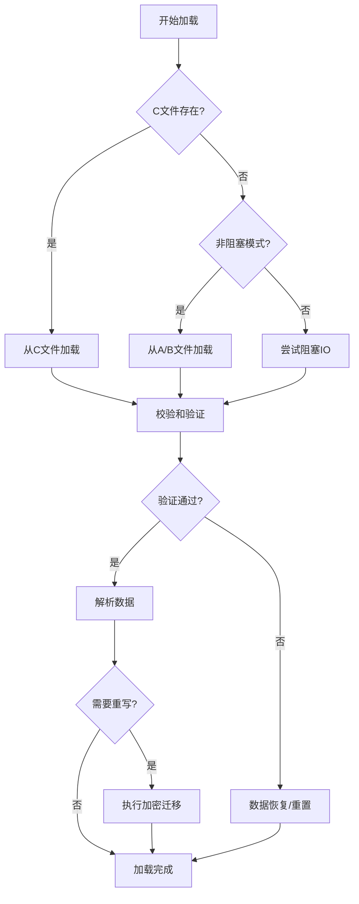
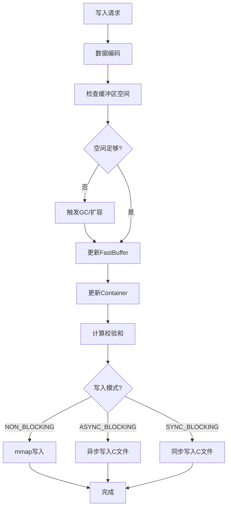

# FastKV 架构设计文档

## 概述

FastKV是一个高性能的Android键值存储库，采用模块化设计和多种优化策略，提供比SharedPreferences更优秀的性能和可靠性。

## 🏗️ 架构组成（静态结构）

FastKV采用清晰的模块化设计，每个模块都有明确的职责分工：

### 核心模块

| 模块 | 职责 | 主要功能 |
|------|------|----------|
| **FastKV** | 核心协调器 | API接口、数据管理、业务逻辑协调 |
| **FileHelper** | 文件I/O管理 | A/B/C文件读写、重写、备份恢复 |
| **DataParser** | 数据解析 | 二进制数据编码解码、容器创建 |
| **GCHelper** | 垃圾回收 | 内存整理、缓冲区扩容、无效数据清理 |
| **BufferHelper** | 缓冲区工具 | 数据打包、校验和计算、底层操作 |
| **LoggerHelper** | 日志管理 | 统一日志输出、错误追踪 |

### 数据容器系列

```
BaseContainer (抽象基类)
├── BooleanContainer    - 布尔值容器
├── IntContainer        - 整数容器
├── LongContainer       - 长整数容器
├── FloatContainer      - 浮点数容器
├── DoubleContainer     - 双精度浮点数容器
└── VarContainer (可变长度容器基类)
    ├── StringContainer  - 字符串容器
    ├── ArrayContainer   - 字节数组容器
    └── ObjectContainer  - 对象容器
```

### 接口定义

- **FastEncoder**: 对象序列化接口
- **FastCipher**: 数据加密接口  
- **FastLogger**: 日志输出接口

## 💾 文件存储结构

FastKV使用多文件策略确保数据安全和性能：

### 文件类型

| 文件扩展名 | 用途 | 特点 |
|------------|------|------|
| `.kva` | 主数据文件A | mmap内存映射，高性能读写 |
| `.kvb` | 主数据文件B | A文件的完整备份 |
| `.kvc` | 阻塞模式文件 | 完整数据文件，用于阻塞写入模式 |
| `.tmp` | 临时文件 | 原子性写入操作的中间文件 |

### 文件内容结构

```
文件头部 (12字节):
┌─────────────┬─────────────┬─────────────────────────┐
│ 数据长度    │ 校验和      │ 保留字段                │
│ (4字节)     │ (8字节)     │                         │
└─────────────┴─────────────┴─────────────────────────┘

数据区域:
┌─────┬─────────┬─────┬─────────┬─────┬─────────┐
│类型 │键长度   │ 键  │值长度   │ 值  │ ...     │
│(1)  │(1)      │(N)  │(2)      │(M)  │         │
└─────┴─────────┴─────┴─────────┴─────┴─────────┘
```

## ⚙️ 运作模式（动态行为）

### 三种写入模式对比

| 模式 | 性能 | 安全性 | 适用场景 |
|------|------|--------|----------|
| **NON_BLOCKING** | 🟢 最高 | 🟡 中等 | 高频读写，可容忍少量数据丢失 |
| **ASYNC_BLOCKING** | 🟡 中等 | 🟢 较高 | 平衡性能与安全性 |
| **SYNC_BLOCKING** | 🔴 较低 | 🟢 最高 | 关键数据，要求绝对安全 |

### 数据加载流程



### 数据写入流程



### 垃圾回收机制

#### 触发条件
- 无效数据超过总数据的1/2
- 缓冲区空间不足
- 手动触发

#### GC过程
1. **标记阶段**: 遍历所有Container，标记有效数据段
2. **整理阶段**: 将有效数据移动到缓冲区前部
3. **更新阶段**: 更新所有Container的偏移量
4. **清理阶段**: 清除无效数据标记，重置统计信息

### 容错和恢复策略

#### 多层保护机制

```
┌─────────────────────────────────────┐
│           应用层                    │
├─────────────────────────────────────┤
│      FastKV API (数据验证)          │
├─────────────────────────────────────┤
│    内存层 (校验和 + 双缓冲)         │
├─────────────────────────────────────┤
│   文件层 (A/B双备份 + 原子写入)     │
├─────────────────────────────────────┤
│     系统层 (mmap + 文件锁)          │
└─────────────────────────────────────┘
```

#### 错误恢复流程

1. **数据损坏检测**: 通过校验和发现问题
2. **自动备份恢复**: 从备份文件恢复数据
3. **模式降级**: mmap失败时转为阻塞模式
4. **数据重建**: 极端情况下重新构建数据文件

## 🔄 生命周期管理

### 初始化阶段
1. **参数验证**: 检查路径、名称、编码器等参数
2. **文件准备**: 创建必要的目录和文件
3. **数据加载**: 从持久化文件加载数据到内存
4. **状态同步**: 确保内存和文件状态一致

### 运行阶段
1. **读操作**: 直接从内存Container读取
2. **写操作**: 更新内存后根据模式持久化
3. **维护操作**: 定期GC、缓冲区管理、文件同步

### 销毁阶段
1. **数据同步**: 确保所有未提交的数据写入文件
2. **资源释放**: 关闭文件句柄、释放内存映射
3. **缓存清理**: 从实例缓存中移除

## 🎯 性能优化策略

### 内存优化
- **零拷贝设计**: 使用ByteBuffer避免数据复制
- **对象池**: 复用Container对象减少GC压力
- **延迟加载**: 大对象按需反序列化

### I/O优化
- **内存映射**: 使用mmap减少系统调用
- **批量写入**: 合并多个写操作
- **异步I/O**: 非阻塞模式下的后台写入

### 算法优化
- **增量GC**: 避免全量数据整理
- **校验和算法**: 使用高效的CRC算法
- **压缩算法**: 可选的数据压缩支持

## 🔒 安全特性

### 数据加密
- **可插拔加密**: 支持自定义加密算法
- **密钥管理**: 与Android KeyStore集成
- **加密迁移**: 支持从明文到密文的平滑迁移

### 数据完整性
- **校验和保护**: 每次读写都验证数据完整性
- **原子操作**: 确保写入操作的原子性
- **版本控制**: 支持数据格式版本管理

## 📊 监控和调试

### 日志系统
- **分级日志**: ERROR、WARN、INFO三个级别
- **上下文信息**: 包含操作类型、数据大小等
- **性能指标**: 记录关键操作的耗时

### 调试支持
- **数据导出**: 支持将内存数据导出为可读格式
- **状态检查**: 提供内部状态查询接口
- **性能分析**: 内置性能监控和分析工具

## 🔮 扩展性设计

### 插件机制
- **编码器插件**: 支持自定义对象序列化
- **加密插件**: 支持多种加密算法
- **日志插件**: 可自定义日志输出方式

### 版本兼容
- **向前兼容**: 新版本可读取旧版本数据
- **向后兼容**: 提供兼容性模式支持
- **平滑升级**: 支持数据格式的渐进式升级

---

> 📝 **注意**: 这份文档描述的是FastKV的整体架构设计。具体的API使用方法和配置选项请参考 [README.md](README.md) 文档。 