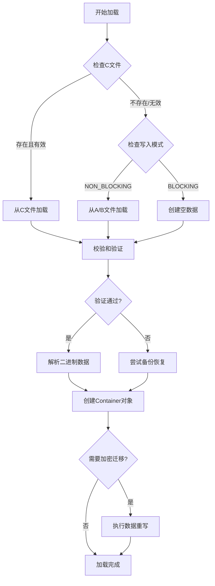
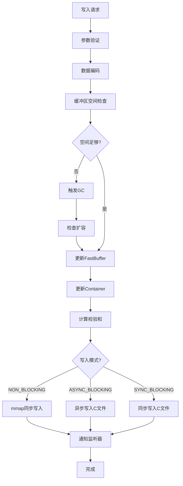
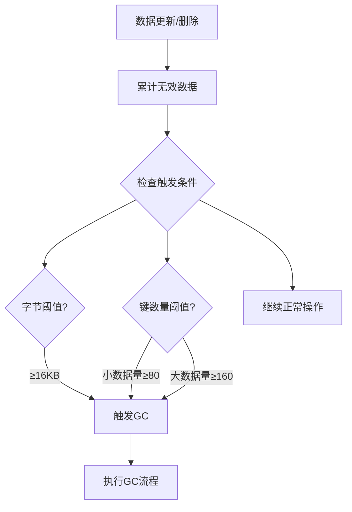
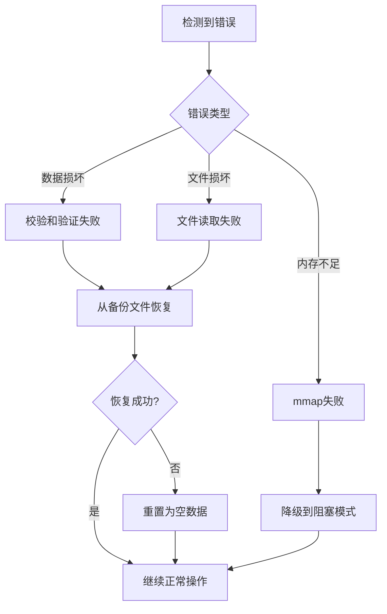

# FastKV 架构设计文档

## 概述

FastKV是一个专为Android平台设计的高性能键值存储库，采用现代化的模块化架构和多种优化策略，在保证数据安全的前提下提供卓越的性能表现。

## 架构组成（静态结构）

FastKV采用清晰的分层模块化设计，每个模块都有明确的职责边界：

### 核心模块架构

```
┌─────────────────────────────────────────────────────┐
│                  FastKV API Layer                   │
│               (SharedPreferences兼容)                │
├─────────────────────────────────────────────────────┤
│                  Business Logic                     │
│            (数据管理、事务控制、监听器管理)              │
├─────────────────────────────────────────────────────┤
│  DataParser  │  GCHelper   │  BufferHelper │ Logger │
│  (数据解析)    │  (垃圾回收)   │  (缓冲区工具) │ (日志)  │
├─────────────────────────────────────────────────────┤
│                   FileHelper                        │
│                  (文件I/O、备份管理)                  │
├─────────────────────────────────────────────────────┤
│  Container系列  │  FastBuffer  │  Interfaces         │
│  (数据容器)      │  (内存缓冲)    │  (扩展接口)         │
└─────────────────────────────────────────────────────┘
```

### 模块职责详解

| 模块 | 核心职责 | 关键功能 |
|------|----------|----------|
| **FastKV** | 核心API和业务协调 | API接口、数据管理、业务逻辑协调、生命周期管理 |
| **FileHelper** | 文件I/O和备份管理 | A/B/C文件读写、mmap映射、备份恢复、文件同步 |
| **DataParser** | 数据解析和序列化 | 二进制数据编码解码、Container创建、类型转换 |
| **GCHelper** | 垃圾回收和内存管理 | 无效数据清理、内存整理、缓冲区扩容收缩 |
| **BufferHelper** | 缓冲区底层操作 | 数据打包、校验和计算、字节序处理 |
| **LoggerHelper** | 日志管理 | 统一日志输出、错误追踪、性能监控 |

### 数据容器系列

```
BaseContainer (抽象基类)
├── 基础类型容器 (固定长度)
│   ├── BooleanContainer    - 布尔值容器 (1字节)
│   ├── IntContainer        - 整数容器 (4字节)
│   ├── LongContainer       - 长整数容器 (8字节)
│   ├── FloatContainer      - 浮点数容器 (4字节)
│   └── DoubleContainer     - 双精度浮点数容器 (8字节)
└── VarContainer (可变长度容器基类)
    ├── StringContainer     - 字符串容器 (UTF-8编码)
    ├── ArrayContainer      - 字节数组容器 (二进制数据)
    └── ObjectContainer     - 对象容器 (自定义序列化)
```

### 扩展接口定义

- **FastEncoder<T>**: 对象序列化接口，支持自定义类型的编码解码
- **FastCipher**: 数据加密接口，提供透明的加解密能力
- **FastLogger**: 日志输出接口，支持自定义日志处理

## 文件存储架构

FastKV采用多文件策略和双重备份机制确保数据安全：

### 文件类型和用途

| 文件扩展名 | 用途 | 写入模式 | 特点 |
|------------|------|----------|------|
| `.kva` | 主数据文件A | NON_BLOCKING | mmap内存映射，高性能读写 |
| `.kvb` | 主数据文件B | NON_BLOCKING | A文件的实时备份 |
| `.kvc` | 阻塞模式数据文件 | BLOCKING | 完整数据文件，用于阻塞写入模式 |
| `.tmp` | 临时文件 | ALL | 原子性写入操作的中间文件 |

### 二进制存储格式

#### 文件头部结构 (12字节)
```
┌─────────────┬─────────────┬
│ 数据长度     │ 校验和       │ 
│ (4字节)     │ (8字节)      │
└─────────────┴─────────────┴
```

#### 数据区域结构
```
基础类型: [type(1)|keyLen(1)|keyData(N)|value(固定长度)]
变长类型: [type(1)|keyLen(1)|keyData(N)|valueLen(2)|value(M)]
大长度类型: [type(1)|keyLen(1)|keyData(N)|valueLen(4)|value(M)]
```

#### 数据类型编码
```
基础类型: 1-5 (BOOLEAN, INT, FLOAT, LONG, DOUBLE)
变长类型: 6-8 (STRING, ARRAY, OBJECT)
大长度类型: 9-11 (STRING_LARGE, ARRAY_LARGE, OBJECT_LARGE)
特殊标记: DELETE_MASK(0x80), EXTERNAL_MASK(0x40)
```

## 运作模式（动态行为）

### 三种写入模式对比

| 模式 | 延迟 | 安全性 | 内存使用 | 适用场景 |
|------|------|--------|----------|----------|
| **NON_BLOCKING** | 最低 | 中等 | 高 | 高频读写，可容忍少量数据丢失 |
| **ASYNC_BLOCKING** | 中等 | 高 | 中等 | 平衡性能与安全性，类似SP.apply() |
| **SYNC_BLOCKING** | 最高 | 最高 | 低 | 关键数据，要求绝对安全，类似SP.commit() |

### 数据加载流程



### 数据写入流程



### 垃圾回收机制

#### 触发策略


#### GC执行流程
1. **段合并阶段**：合并相邻的无效内存段
2. **数据压缩阶段**：将有效数据向前移动
3. **偏移更新阶段**：批量更新Container偏移量
4. **校验和重算阶段**：增量或全量重算校验和
5. **文件同步阶段**：同步到A/B文件（非阻塞模式）
6. **缓冲区优化阶段**：必要时截断缓冲区

### 容错和恢复策略

#### 数据保护机制
- **API层面**：参数验证，防止无效输入
- **数据层面**：校验和验证，检测数据损坏
- **存储层面**：双文件备份（非阻塞模式），临时文件写入（阻塞模式）
- **系统层面**：依赖操作系统的mmap和文件系统保障

#### 错误恢复策略


## 性能优化策略

### 内存优化
- **内存映射**：使用mmap技术减少数据复制
- **延迟加载**：大对象和外部文件按需加载，减少内存占用
- **缓存机制**：解密后的数据缓存在内存中，避免重复解密

### I/O优化
- **内存映射**：使用mmap技术，将文件映射到内存
- **异步写入**：非阻塞模式下的后台写入，不阻塞主线程
- **原子操作**：使用临时文件和原子重命名确保数据一致性

### 算法优化
- **增量GC**：只处理无效数据段，避免全量数据移动
- **XOR校验和**：计算速度快且支持增量更新
- **按需扩容**：根据数据量动态调整缓冲区大小

### 并发优化
- **同步控制**：使用同步方法保证线程安全
- **异步加载**：数据加载在后台线程进行
- **线程池复用**：可配置的线程池，避免频繁创建线程

## 安全特性

### 数据完整性保护
- **校验和验证**：每次读取都进行校验和验证
- **双文件备份**：A/B文件互为备份，防止单点故障（非阻塞模式）
- **原子写入**：使用临时文件确保写入的原子性（阻塞模式）

### 数据加密支持
- **可插拔加密**：支持自定义加密算法实现
- **透明加解密**：对应用层透明的加解密过程
- **加密迁移**：支持从明文到密文的平滑迁移

### 错误处理
- **异常处理**：从底层I/O到上层API的异常处理
- **自动降级**：mmap失败时自动降级到阻塞模式
- **日志记录**：错误日志和基本监控
- **恢复机制**：从备份文件恢复

---
