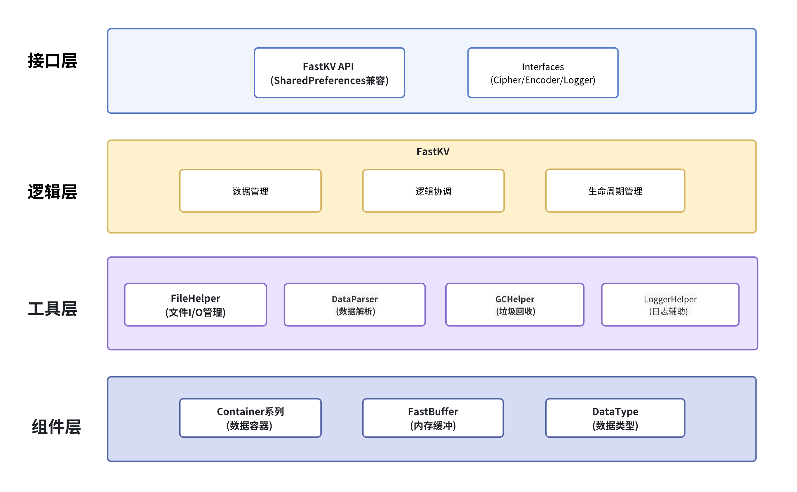
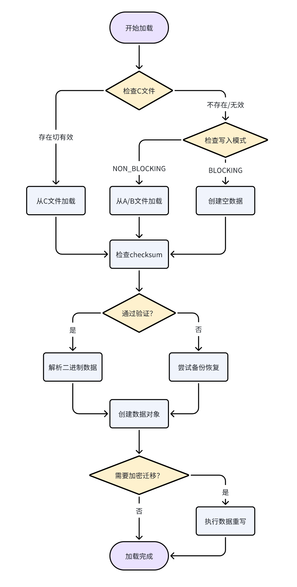
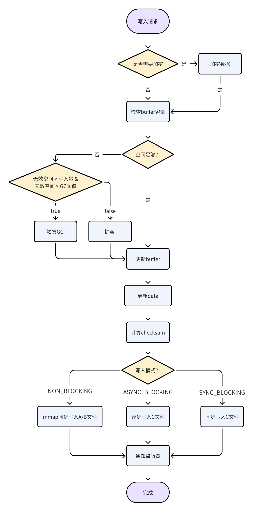
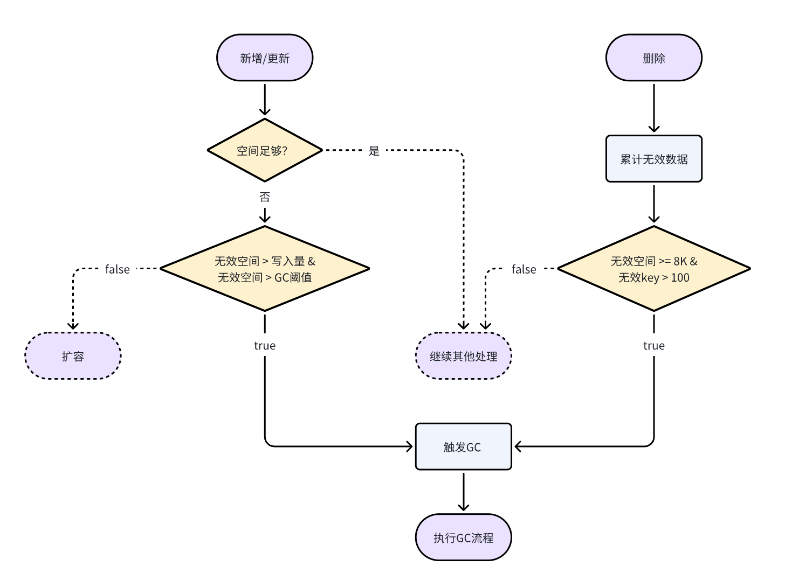
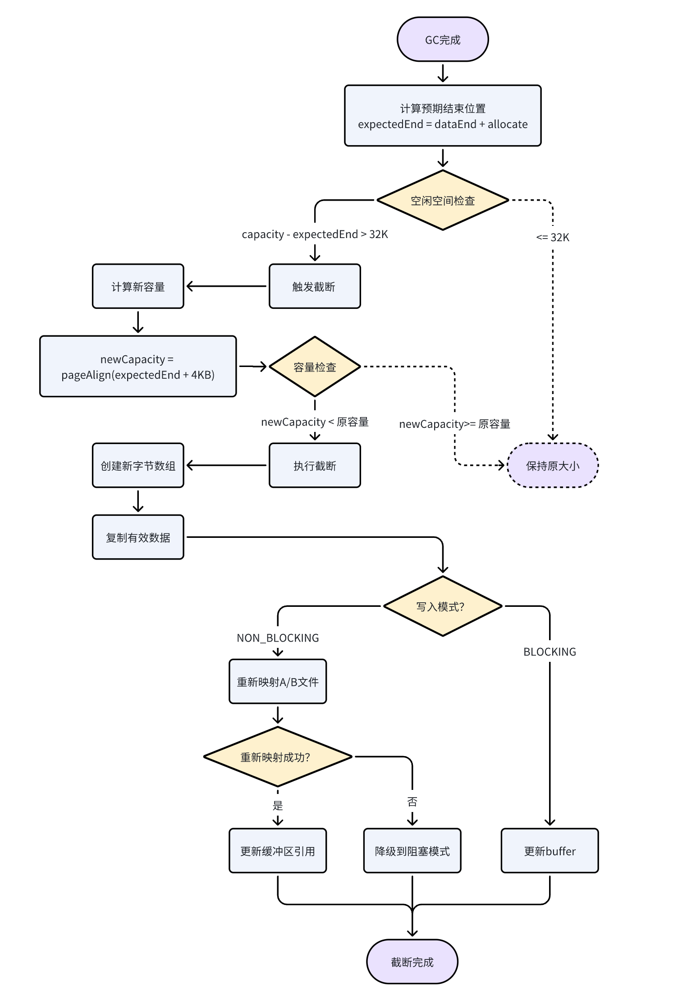
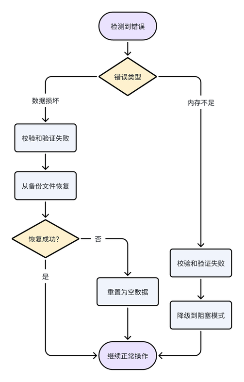

# FastKV 架构设计文档

## 1. 概述

FastKV是一个专为Android平台设计的高性能键值存储库，采用多种优化策略，在保证数据安全的前提下提供卓越的性能表现。

## 2. 架构组成

FastKV采用清晰的分层模块化设计，每个模块都有明确的职责边界：

### 2.1 核心模块架构


### 2.2 模块职责详解

| 模块 | 核心职责 | 关键功能 |
|------|----------|----------|
| **FastKV** | 核心API和业务协调 | API接口、数据管理、业务逻辑协调、生命周期管理 |
| **FileHelper** | 文件I/O管理与工具服务 | mmap内存映射、A/B/C文件读写、备份恢复、文件同步、缓冲区操作 |
| **DataParser** | 数据解析和序列化 | 二进制数据编码解码、Container创建、类型转换 |
| **GCHelper** | 垃圾回收和内存管理 | 无效数据清理、内存整理、缓冲区扩容收缩 |

### 2.3 数据容器系列

```
BaseContainer (抽象基类)
├── 基础类型容器 (固定长度)
│   ├── BooleanContainer    - 布尔值容器 (1字节)
│   ├── IntContainer        - 整数容器 (4字节)
│   ├── LongContainer       - 长整数容器 (8字节)
│   ├── FloatContainer      - 浮点数容器 (4字节)
│   └── DoubleContainer     - 双精度浮点数容器 (8字节)
└── VarContainer (可变长度容器基类)
    ├── StringContainer     - 字符串容器 (UTF-8编码)
    ├── ArrayContainer      - 字节数组容器 (二进制数据)
    └── ObjectContainer     - 对象容器 (自定义序列化)
```

### 2.4 扩展接口定义

- **FastEncoder<T>**: 对象序列化接口，支持自定义类型的编码解码
- **FastCipher**: 数据加密接口，提供透明的加解密能力
- **FastLogger**: 日志输出接口，支持自定义日志处理

## 3. 文件存储架构

FastKV采用多文件策略和双重备份机制确保数据安全：

### 3.1 文件类型和用途

| 文件扩展名 | 用途 | 写入模式 | 特点 |
|------------|------|----------|------|
| `.kva` | 主数据文件A | NON_BLOCKING | mmap内存映射，高性能读写 |
| `.kvb` | 主数据文件B | NON_BLOCKING | A文件的实时备份 |
| `.kvc` | 阻塞模式数据文件 | BLOCKING | 完整数据文件，用于阻塞写入模式 |
| `.tmp` | 临时文件 | ALL | 原子性写入操作的中间文件 |

### 3.2 二进制存储格式

#### 3.2.1 文件头部结构 (12字节)
```
┌─────────────┬─────────────┬
│ 数据长度     │ 校验和       │ 
│ (4字节)     │ (8字节)      │
└─────────────┴─────────────┴
```
- “数据长度”仅低位30位有效数据的字节数，31bit表示是否加密， 32bit（符号位）表示是否正在更新。
- “校验和”使用XOR算法计算，确保数据完整性。

#### 3.2.2 数据区域结构
```
基础类型: [type(1)|keyLen(1)|keyData(N)|value(固定长度)]
变长类型: [type(1)|keyLen(1)|keyData(N)|valueLen(2)|value(M)]
大长度类型: [type(1)|keyLen(1)|keyData(N)|valueLen(4)|value(M)]
```

#### 3.2.3 数据类型编码
```
基础类型: 1-5 (BOOLEAN, INT, FLOAT, LONG, DOUBLE)
变长类型: 6-8 (STRING, ARRAY, OBJECT)
大长度类型: 9-11 (STRING_LARGE, ARRAY_LARGE, OBJECT_LARGE)
特殊标记: DELETE_MASK(0x80), EXTERNAL_MASK(0x40)
```

## 4. 运作模式

### 4.1 三种写入模式对比

| 模式 | 延迟 | 安全性 | 内存使用 | 适用场景 |
|------|------|--------|----------|----------|
| **NON_BLOCKING** | 最低 | 中等 | 高 | 高频读写，可容忍少量数据丢失 |
| **ASYNC_BLOCKING** | 中等 | 高 | 中等 | 平衡性能与安全性，类似SP.apply() |
| **SYNC_BLOCKING** | 最高 | 最高 | 低 | 关键数据，要求绝对安全，类似SP.commit() |

### 4.2 数据加载流程


### 4.3 数据写入流程


### 4.4 垃圾回收机制

#### 4.4.1 触发策略


#### 4.4.2 GC执行流程
1. **段合并阶段**：合并相邻的无效内存段
2. **数据压缩阶段**：将有效数据向前移动
3. **偏移更新阶段**：批量更新Container偏移量
4. **校验和重算阶段**：增量或全量重算校验和
5. **文件同步阶段**：同步到A/B文件（非阻塞模式）
6. **缓冲区截断阶段**：根据需要收缩缓冲区大小

#### 4.4.3 缓冲区截断机制

缓冲区截断是GC流程的最后一步，用于优化内存使用：



**截断触发条件**：
- 空闲空间超过32KB（TRUNCATE_THRESHOLD）
- 确保截断后仍有足够空间供后续分配

**截断策略**：
- **容量计算**：新容量 = 页对齐(期望大小 + 4KB预留空间)
- **安全检查**：只有在新容量确实小于原容量时才执行截断
- **数据保护**：先创建新数组并复制数据，确保数据完整性

**模式适配**：
- **BLOCKING模式**：只需更新fastBuffer引用
- **NON_BLOCKING模式**：需要重新映射A/B文件，失败时降级到阻塞模式

### 4.5 容错和恢复策略

#### 4.5.1 数据保护机制
- **API层面**：参数验证，防止无效输入
- **数据层面**：校验和验证，检测数据损坏
- **存储层面**：双文件备份（非阻塞模式），临时文件写入（阻塞模式）

#### 4.5.2 错误恢复策略


## 5. 性能优化策略

### 5.1 内存优化
- **内存映射**：使用mmap技术减少数据复制
- **延迟加载**：大对象和外部文件按需加载，减少内存占用
- **缓存机制**：解密后的数据缓存在内存中，避免重复解密

### 5.2 I/O优化
- **内存映射**：使用mmap技术，将文件映射到内存
- **异步写入**：非阻塞模式下的后台写入，不阻塞主线程
- **原子操作**：使用临时文件和原子重命名确保数据一致性

### 5.3 算法优化
- **增量GC**：只处理无效数据段，避免全量数据移动
- **XOR校验和**：计算速度快且支持增量更新
- **按需扩容**：根据数据量动态调整缓冲区大小

### 5.4 并发优化
- **同步控制**：使用同步方法保证线程安全
- **异步加载**：数据加载在后台线程进行
- **线程池复用**：可配置的线程池，避免频繁创建线程
