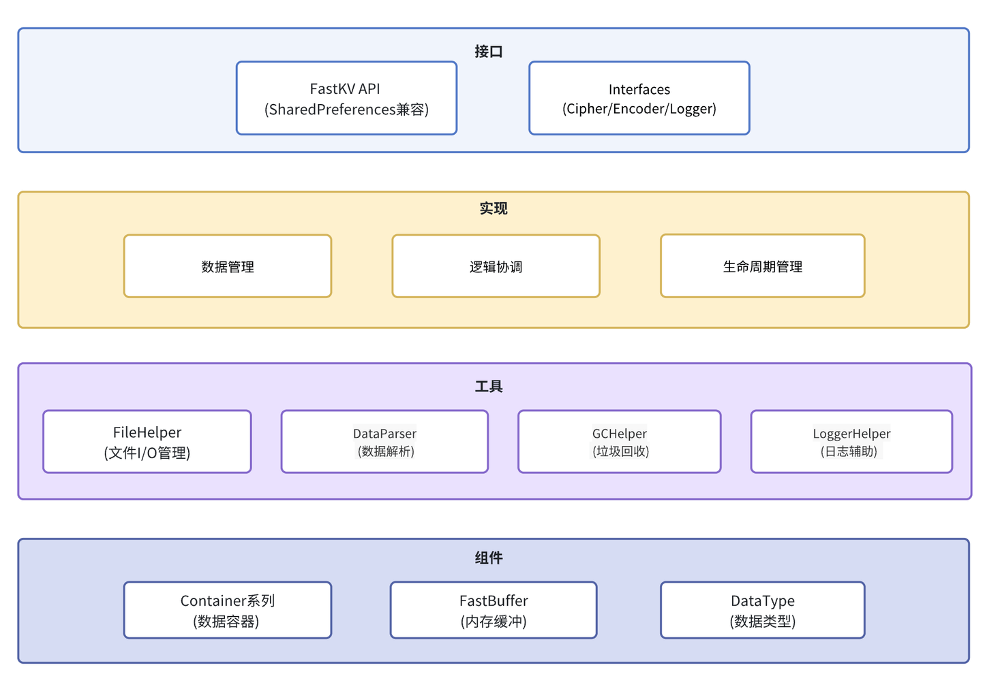

# FastKV 架构设计文档

## 1. 概述

FastKV是一个专为Android平台设计的高性能键值存储库，采用多种优化策略，在保证数据安全的前提下提供卓越的性能表现。

## 2. 架构组成

FastKV采用清晰的分层模块化设计，每个模块都有明确的职责边界：

### 2.1 核心模块架构


### 2.2 模块职责详解

| 模块 | 核心职责 | 关键功能 |
|------|----------|----------|
| **FastKV** | 核心API和业务协调 | API接口、数据管理、业务逻辑协调、生命周期管理 |
| **FileHelper** | 文件I/O管理与工具服务 | mmap内存映射、A/B/C文件读写、备份恢复、文件同步、缓冲区操作 |
| **DataParser** | 数据解析 | 二进制数据编码解码、Container创建、类型转换 |
| **GCHelper** | 垃圾回收和内存管理 | 无效数据清理、内存整理、缓冲区扩容收缩 |
| **LoggerHelper** | 日志接口封装       | 记录日志                     |

### 2.3 数据容器系列

```
BaseContainer (抽象基类)
├── 基础类型容器 (固定长度)
│   ├── BooleanContainer    - 布尔值容器 (1字节)
│   ├── IntContainer        - 整数容器 (4字节)
│   ├── LongContainer       - 长整数容器 (8字节)
│   ├── FloatContainer      - 浮点数容器 (4字节)
│   └── DoubleContainer     - 双精度浮点数容器 (8字节)
└── VarContainer (可变长度容器基类)
    ├── StringContainer     - 字符串容器 (UTF-8编码)
    ├── ArrayContainer      - 字节数组容器 (二进制数据)
    └── ObjectContainer     - 对象容器 (自定义序列化)
```

### 2.4 扩展接口定义

- **FastEncoder<T>**: 对象序列化接口，支持自定义类型的编码解码
- **FastCipher**: 数据加密接口，提供透明的加解密能力
- **FastLogger**: 日志输出接口，支持自定义日志处理

## 3. 文件存储架构

FastKV采用多文件策略和双重备份机制确保数据安全：

### 3.1 文件类型和用途

| 文件扩展名 | 用途 | 写入模式 | 特点 |
|------------|------|----------|------|
| `.kva` | 主数据文件A | NON_BLOCKING | mmap内存映射，高性能读写 |
| `.kvb` | 主数据文件B | NON_BLOCKING | A文件的实时备份 |
| `.kvc` | 阻塞模式数据文件 | BLOCKING | 完整数据文件，用于阻塞写入模式 |
| `.tmp` | 临时文件 | ALL | 原子性写入操作的中间文件 |

### 3.2 二进制存储格式

#### 3.2.1 文件头部结构 (12字节)
```
┌─────────────┬─────────────┬
│ 数据长度     │ checksum    │ 
│ (4字节)     │ (8字节)      │
└─────────────┴─────────────┴
```
- “数据长度”仅低位30位有效数据的字节数，31bit表示是否加密， 32bit（符号位）表示是否正在更新。
- “checksum” 使用XOR算法计算，确保数据完整性。

#### 3.2.2 数据区域结构
```
基础类型: [type(1)|keyLen(1)|keyData(N)|value(固定长度)]
变长类型: [type(1)|keyLen(1)|keyData(N)|valueLen(2)|value(M)]
大长度类型: [type(1)|keyLen(1)|keyData(N)|valueLen(4)|value(M)]
```

#### 3.2.3 数据类型编码
```
基础类型: 1-5 (BOOLEAN, INT, FLOAT, LONG, DOUBLE)
变长类型: 6-8 (STRING, ARRAY, OBJECT)
大长度类型: 9-11 (STRING_LARGE, ARRAY_LARGE, OBJECT_LARGE)
特殊标记: DELETE_MASK(0x80), EXTERNAL_MASK(0x40)
```

## 4. 运作模式

### 4.1 三种写入模式对比

| 模式 | 延迟 | 安全性 | 内存使用 | 适用场景 |
|------|------|--------|----------|----------|
| **NON_BLOCKING** | 最低 | 中等 | 高 | 高频读写，可容忍少量数据丢失 |
| **ASYNC_BLOCKING** | 中等 | 高 | 中等 | 平衡性能与安全性，类似SP.apply() |
| **SYNC_BLOCKING** | 最高 | 最高 | 低 | 关键数据，要求绝对安全，类似SP.commit() |

### 4.2 数据加载机制

#### 4.2.1 加载流程


#### 4.2.2 并发加载设计

FastKV采用了异步加载机制来优化多实例并发创建的性能：

1. **Builder锁与数据加载分离**：
   - `Builder.build()`中对`Builder.class`的同步锁只保护实例创建和缓存
   - 数据加载在异步线程中进行，避免阻塞实例创建过程

2. **异步加载的必要性**：
   - 如果在构造函数中同步加载数据，会导致多个实例创建时相互排队
   - 通过异步加载，多个FastKV实例可以并发进行数据加载
   - 提升了应用启动时的并发性能

3. **等待-通知机制**：
   ```java
   // 构造函数中等待数据加载开始
   synchronized (data) {
       FastKVConfig.getExecutor().execute(this::loadData);
       if (!startLoading) {
           data.wait(); // 等待loadData获得锁
       }
   }
   
   // loadData中通知构造函数继续
   synchronized (data) {
       startLoading = true;
       data.notify(); // 通知构造函数完成
   }
   ```

4. **读写操作的同步保护**：
   - 所有读写操作（如`getBoolean`、`putBoolean`）都使用`synchronized`修饰
   - 确保在数据加载完成前，读写操作会等待 —— 因为`loadData`函数最先获取到对象锁。

#### 4.2.3 容错和恢复策略

FastKV在数据加载过程中采用分层次的错误恢复策略，确保在各种异常情况下都能正常工作：

1. **分层次的错误处理**：
   - **数据损坏**：校验和验证失败时，尝试从备份文件恢复
   - **文件损坏**：文件读取失败时，尝试从另一个备份文件恢复
   - **内存不足**：mmap操作失败时，降级到阻塞模式使用普通文件I/O

2. **多重数据保护**：
   - **双文件备份**：A/B文件实时同步，确保数据安全性
   - **校验和验证**：XOR算法快速检测数据完整性
   - **原子性写入**：使用临时文件确保写入操作的原子性

3. **优雅降级策略**：
   - 当高性能模式(mmap)失败时，自动降级到兼容性更好的阻塞模式
   - 即使在最坏情况下也能保证基本的读写功能

### 4.3 数据写入机制


**性能优化**：
- **内存映射**：使用mmap技术将文件映射到内存，减少数据复制
- **异步写入**：非阻塞模式下的后台写入，不阻塞主线程
- **原子操作**：使用临时文件和原子重命名确保数据一致性
- **按需扩容**：根据数据量动态调整缓冲区大小

### 4.4 垃圾回收机制

#### 4.4.1 触发策略

FastKV采用双重条件触发策略来决定何时执行垃圾回收：

**触发条件**：
- **新增/更新操作**：当进行数据写入时，首先检查空间是否足够
  - 如果空间不足，会进一步检查是否满足GC条件：
    - 无效字节数 > 写入量 && 无效字节数 > 8KB → 先执行GC
    - 否则直接扩容缓冲区

- **删除操作**：当删除数据时，会累计无效数据统计，然后检查以下两个条件：
  - **无效空间阈值**：无效空间 >= 8KB
  - **无效key数量阈值**：无效key > 100个

**触发逻辑**：
1. **写入时的智能选择**：空间不足时，优先尝试GC回收空间，只有在GC无法满足需求时才扩容
2. **删除后的检查**：无效空间 >= 8KB || 无效key > 100个 → 触发GC
3. **预防式GC**：避免缓冲区无限增长，优化内存使用效率

**设计目标**：
- 避免频繁GC影响性能
- 及时回收无效空间，防止内存浪费
- 平衡内存使用效率和执行性能

#### 4.4.2 GC执行流程
1. **段合并阶段**：合并相邻的无效内存段
2. **数据压缩阶段**：将有效数据向前移动
3. **偏移更新阶段**：批量更新Container偏移量
4. **校验和重算阶段**：增量或全量重算校验和
5. **文件同步阶段**：同步到A/B文件（非阻塞模式）
6. **缓冲区截断阶段**：根据需要收缩缓冲区大小

**要点**：只处理无效数据段，避免全量数据移动

#### 4.4.3 缓冲区截断机制

缓冲区截断是GC流程的最后一步，用于优化内存使用：


**关键机制**：当空闲空间超过32KB时触发截断，通过页对齐计算新容量，确保数据完整性的同时优化内存使用。
